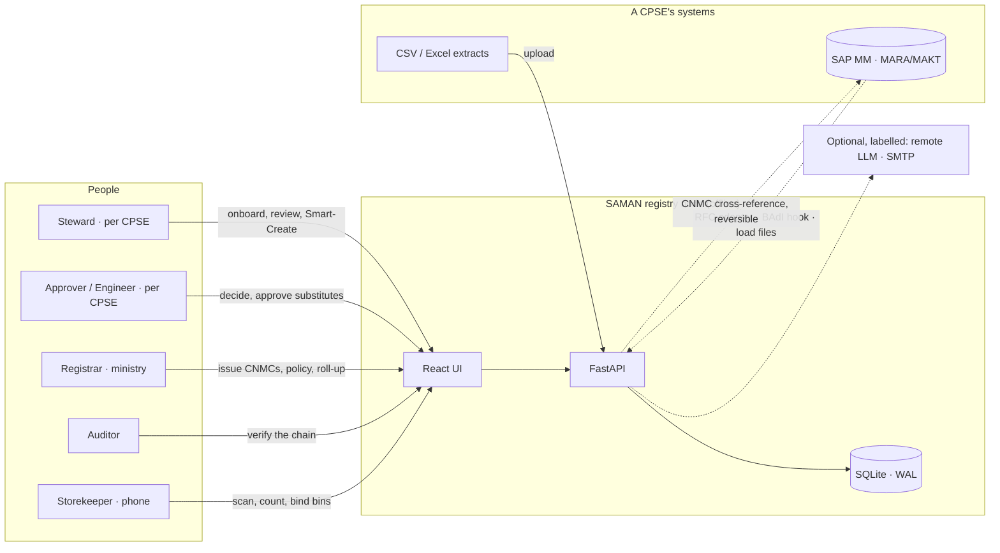
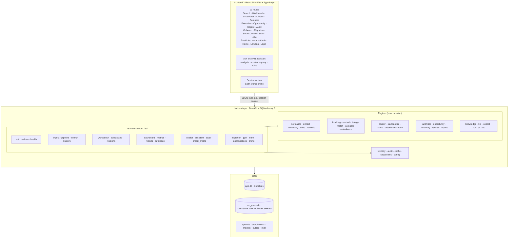
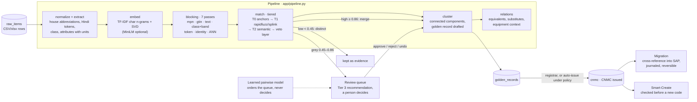
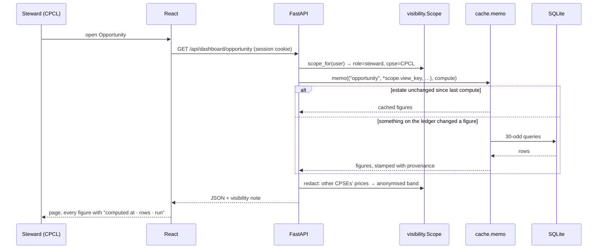
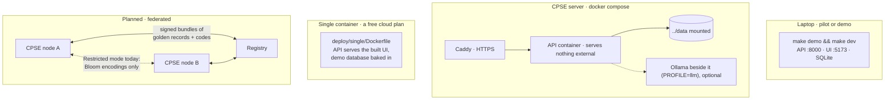
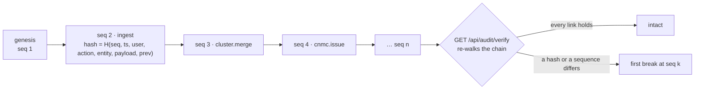

# SAMAN architecture

*The system in six diagrams: who touches it, what it is made of, how a
catalogue row becomes a code, how a request is scoped, how it is deployed,
and how the ledger holds. Diagrams are Mermaid and render on GitHub; every
name in them is a real module, table or route in this repository.*

---

## 1. System context



Nothing leaves the node unless an operator configures it; the dotted lines
are the optional or planned integrations, and each is named on screen when
it is in use (`docs/HOW_IT_WORKS.md` §1).

## 2. Components



Every engine is importable and testable without the web layer; the routers
are thin. The three cross-cutting modules are the ones that must never be
bypassed: `visibility` (who sees which price), `audit` (every mutation on the
chain), `cache` (dashboards memoised on the estate's version).

## 3. From a catalogue row to a code



Thresholds come from `make tune` on the 60% tuning split and are frozen in
`match.py`; every number reported is measured on the 40% held-out split.
The veto layer is rules over identity-critical attributes and overrides any
score. The language model, where present, words the Tier-3 sentence and
never decides.

## 4. A request, scoped



The same `Scope` gates the Copilot's reviewed queries and the weekly
reports, so no screen can become a bypass. The memo key is the estate's
version (ledger head of estate-changing events, latest run, row counts, the
day), so a stale figure cannot be served and a sign-in does not recompute
anything.

## 5. Deployment shapes



Today's registry is one node that every CPSE signs into, with row-level
visibility doing the separating. Restricted mode is the first piece of the
federated shape that exists; the bundles are Stage 3 of the plan.

## 6. The ledger



Each hash covers its own sequence number, so reordering is detected as well
as tampering. Every mutation goes through `audit.record`; a decision, a
merge, an issued code, a migration batch and its rollback, a policy change
and a sign-in are all events. Reads are not. Sign-ins are folded on the
Audit page by default and are excluded from the memo key because they change
no figure.

## 7. Where things live

```
backend/
  app/               engines and routers (see §2); main.py wires them
  tests/             1,320 tests; conftest seeds and runs the pipeline once
  scripts/           e2e_demo.py (five demo moves in a browser), screenshots, licences
frontend/
  src/routes/        one file per screen
  src/components/    Shell, Assistant, primitives (Table, Chip, Field…), charts
  src/lib/           api.ts (typed client), session, i18n, csv, motion, hooks
  public/            manifest, service worker, icons, the OCR engine
deploy/              docker compose, Caddy, the single-container image
data/                the databases, uploads, models, outbox (git-ignored)
docs/                INSTALL · HOW_IT_WORKS · ARCHITECTURE · PROJECT_BRIEF ·
                     REFINEMENT_PLAN · ROADMAP · sap-integration · screenshots
```
